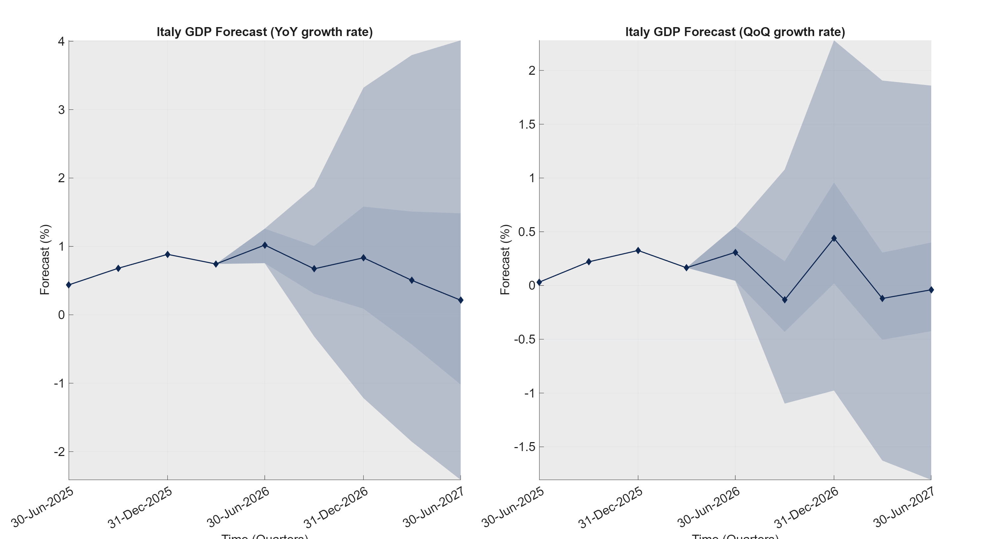
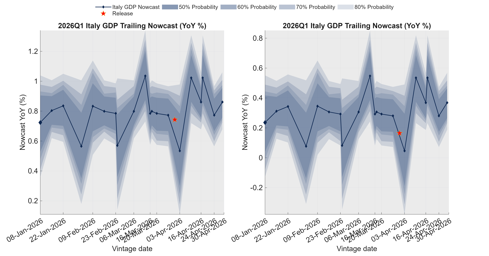

This page updates on Fridays on a weekly base.

## Italy GDP Nowcast Report

The Italian GDP nowcasts are constructed using the Mixed Frequency Bayesian Vector AutoRegressive (MFBVAR) model as in Schorfheide and Song (2015, JBES).
The MFBVAR model is estimated using the <a href="https://github.com/naffe15/BVAR_">Empirical Macro Toolbox, see <a href="https://github.com/naffe15/BVAR_/blob/master/HitchhikerGuide_.pdf">Ferroni and Canova (2020).

**Vintage date:** 08-May-2026

**Nowcast quarter:** 2026:II

**Summary:** Italy’s 2026 Q2 GDP nowcast is 1.02% YoY and 0.31% QoQ (08-May vintage). Versus 01-May, that’s an upward revision of +0.22pp YoY and +0.21pp QoQ. The only new data this week was March retail sales (-0.10% m/m)t.

## 1. Latest nowcast

Latest nowcast (median, 20 and 80 percentiles) based on vintage **08-May-2026**:

- YoY growth (%): `1.02` [`0.81`,`1.21`]
- QoQ growth (%): `0.31` [`0.10`,`0.50`]
- GDP log level: `4.7165` [`4.7144`,`4.7184`]

## 2. Trailing nowcast charts

The bands summarize model uncertainty, not a formal policy forecast range

### Trailing nowcast and distribution – YoY growth

### Trailing nowcast and distribution – QoQ growth

## 3. Trailing nowcast table

| Vintage date | Log level (p50) | YoY (%, p50) | QoQ (%, p50) |
|--------------|----------------:|--------------:|--------------:|
| 08-May-2026 | 4.7165 | 1.0 | 0.3 |
| 01-May-2026 | 4.7139 | 0.8 | 0.1 |
| 24-Apr-2026 | 4.7170 | 1.1 | 0.2 |
| 17-Apr-2026 | 4.7152 | 0.9 | 0.1 |
| 10-Apr-2026 | 4.7157 | 0.9 | 0.1 |
| 03-Apr-2026 | 4.7156 | 0.9 | 0.1 |

## 4. Short-run GDP projection charts

## 5. Interpretation of release values

Release values represent period-on-period changes. For log-transformed series, they approximate percentage growth rates, while for level series they represent absolute changes (for example, percentage-point changes for rates and index-point changes for survey balances).

| Series | Transformation | Interpretation of release value |
|--------|----------------|----------------------------------|
| Retail | Log | Month-on-month growth rate (%) |
| UNR | Level | Change in percentage points (pp) |
| ConsumerConf | Level | Change in index points |
| IndustrialConf | Level | Change in index points |
| IPI | Log | Month-on-month growth rate (%) |
| IPI-DE | Log | Month-on-month growth rate (%) |
| HICP | Log | Month-on-month growth rate (%) |
| EURIBOR-1Y | Level | Change in percentage points (pp) |
| EXP | Log | Month-on-month growth rate (%) |
| IMP | Log | Month-on-month growth rate (%) |
| RGDP | Log + quarterly-to-monthly fill | Approx. monthly growth rate (%) |

## 6. Data updates since previous vintage

### 6A. New releases

Below we list only the genuinely new releases, i.e. observations that were missing in the previous vintage and become available in the current one. The last column reports the release value, i.e. the period-on-period change implied by the current vintage (for log-transformed series, approximately a growth rate in %; for level series, an absolute change).

| From vintage | To vintage | Series | Observation date | New value | Release value |
|--------------|------------|--------|------------------|----------:|--------------:|
| 01-May-2026 | 08-May-2026 | Retail | 31-Mar-2026 | 4.58 | -0.10 |
| 24-Apr-2026 | 01-May-2026 | ConsumerConf | 30-Apr-2026 | -23.90 | -3.80 |
| 24-Apr-2026 | 01-May-2026 | IndustrialConf | 30-Apr-2026 | -6.90 | -0.90 |
| 24-Apr-2026 | 01-May-2026 | EURIBOR1Y | 30-Apr-2026 | 2.75 | 0.18 |
| 24-Apr-2026 | 01-May-2026 | UNR | 31-Mar-2026 | 5.20 | -0.20 |
| 24-Apr-2026 | 01-May-2026 | RGDP | 31-Mar-2026 | 4.71 | NaN |

### 6B. Value changes

Below we list only the changes in the already published data between consecutive vintages. The last column reports the revision, computed as New value minus Old value.

| From vintage | To vintage | Series | Observation date | Old value | New value | Revision |
|--------------|------------|--------|------------------|----------:|----------:|---------:|
| 24-Apr-2026 | 01-May-2026 | ConsumerConf | 31-Mar-2026 | -20.0000 | -20.1000 | -0.1000 |
| 24-Apr-2026 | 01-May-2026 | IndustrialConf | 31-Mar-2026 | -5.8000 | -6.0000 | -0.2000 |

## 7. Dataset

### Data coverage

| Series | Description | Start | End |
|--------|-------------|-------|-----|
| Retail | Turnover and volume of sales in wholesale and retail trade, SA, monthly. | M | EUROSTAT |
| UNR | Unemployment Rate, SA, monthly. | M | EUROSTAT |
| ConsumerConf | Eurostat’s consumer confidence, SA, monthly. | M | EUROSTAT |
| IndustrialConf | Eurostat’s industrial confidence (manufacturing proxy), SA, monthly. | M | EUROSTAT |
| IPI | Industrial Production Index, SA, monthly. | M | EUROSTAT |
| IPI-DE | Industrial Production Index, SA, monthly. | M | EUROSTAT |
| HICP | HICP, NSA, monthly. | M | EUROSTAT |
| EURIBOR-1Y | Euribor 1Y monthly avg (ECB). | M | ECB |
| EXP | Exports to World, SA, monthly. | M | ISTAT |
| IMP | Imports from World, SA, monthly. | M | ISTAT |
| RGDP | Real GDP, SA, chain‑linked (quarterly). | Q | EUROSTAT |

## 8. Previous-quarter nowcast vs realized GDP

This chart compares the sequence of nowcasts for the previous quarter with the subsequently released GDP estimate.

---

Report automatically generated on 08-May-2026 12:39:22.
