## Italy GDP Nowcast Report

The Italian GDP nowcasts are constructed using the Mixed Frequency Bayesian Vector AutoRegressive (MFBVAR) model as in Schorfheide and Song (2015, JBES).
The MF-BVAR model is estimated using the Empirical Macro Toolbox, discussed in Ferroni and Canova (2020).
This page updates on Fridays on a weekly base.

**Vintage date:** 24-Apr-2026

**Nowcast quarter:** 2026:I

## 1. Latest nowcast

Latest nowcast based on vintage **24-Apr-2026**:

- YoY growth (%): `0.86`
- QoQ growth (%): `0.37`
- GDP log level (p50): `4.7149`

## 2. Trailing nowcast charts

### Trailing nowcast and distribution – YoY growth

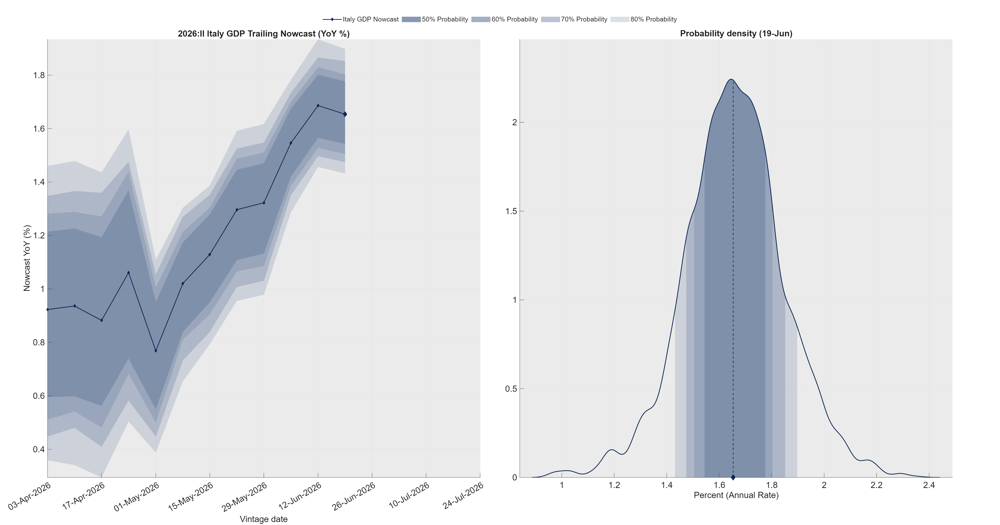

### Trailing nowcast and distribution – QoQ growth

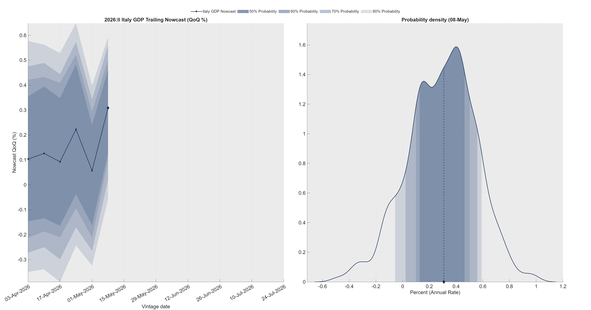

## 3. Trailing nowcast table

| Vintage date | Log level (p50) | YoY (%, p50) | QoQ (%, p50) |
|--------------|----------------:|--------------:|--------------:|
| 24-Apr-2026 | 4.7149 | 0.9 | 0.4 |
| 17-Apr-2026 | 4.7142 | 0.8 | 0.3 |
| 10-Apr-2026 | 4.7142 | 0.8 | 0.3 |
| 03-Apr-2026 | 4.7143 | 0.8 | 0.3 |
| 27-Mar-2026 | 4.7140 | 0.8 | 0.3 |

## 4. Forecast charts

### GDP forecast – Log levels

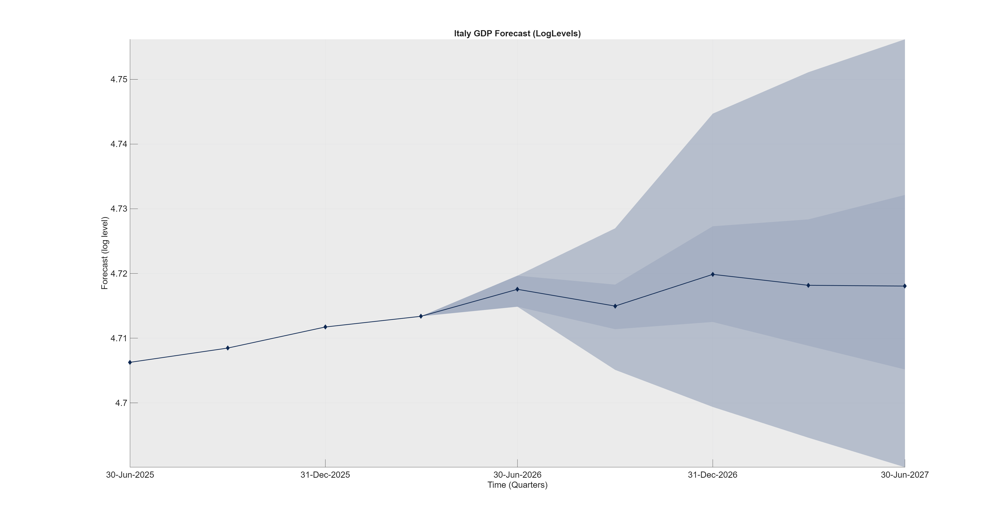

### GDP forecast – YoY growth

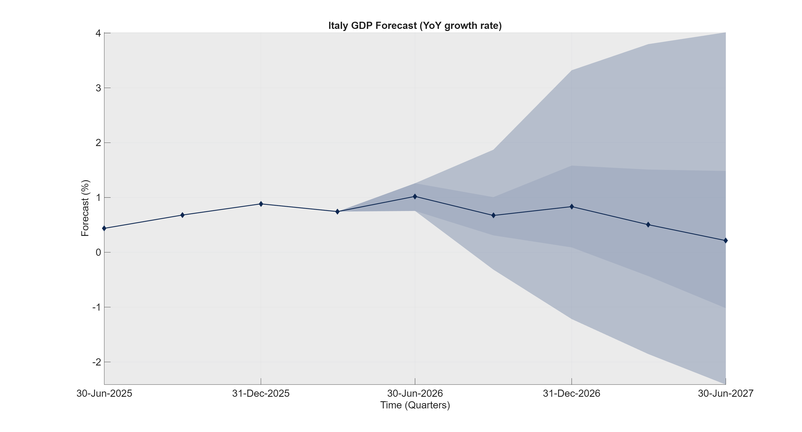

### GDP forecast – QoQ growth

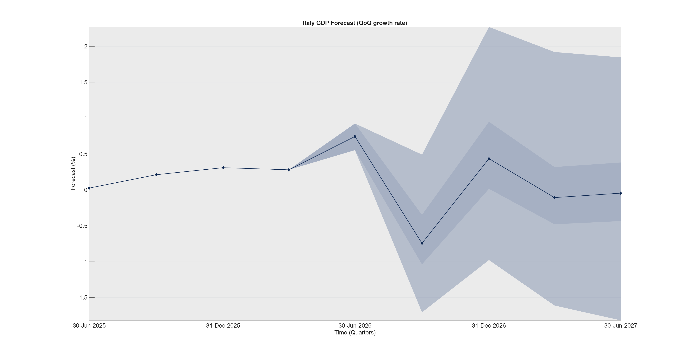

## 5. Interpretation of release values

Release values represent period-on-period changes. For log-transformed series, they approximate percentage growth rates, while for level series they represent absolute changes (for example, percentage-point changes for rates and index-point changes for survey balances).

| Series | Transformation | Interpretation of release value |
|--------|----------------|----------------------------------|
| Retail | Log | Month-on-month growth rate (%) |
| UNR | Level | Change in percentage points (pp) |
| ConsumerConf | Level | Change in index points |
| IndustrialConf | Level | Change in index points |
| IPI | Log | Month-on-month growth rate (%) |
| IPI-DE | Log | Month-on-month growth rate (%) |
| HICP | Log | Month-on-month growth rate (%) |
| EURIBOR-1Y | Level | Change in percentage points (pp) |
| EXP | Log | Month-on-month growth rate (%) |
| IMP | Log | Month-on-month growth rate (%) |
| RGDP | Log + quarterly-to-monthly fill | Approx. monthly growth rate (%) |

## 6. Data updates since previous vintage

### 6A. New releases

Below we list only the genuinely new releases, i.e. observations that were missing in the previous vintage and become available in the current one. The last column reports the release value, i.e. the period-on-period change implied by the current vintage (for log-transformed series, approximately a growth rate in %; for level series, an absolute change).

| From vintage | To vintage | Series | Observation date | New value | Release value |
|--------------|------------|--------|------------------|----------:|--------------:|
| 17-Apr-2026 | 24-Apr-2026 | EXP | 28-Feb-2026 | 10.91 | 2.54 |
| 17-Apr-2026 | 24-Apr-2026 | IMP | 28-Feb-2026 | 10.81 | 3.44 |
| 03-Apr-2026 | 10-Apr-2026 | IPI | 28-Feb-2026 | 4.54 | 0.11 |
| 03-Apr-2026 | 10-Apr-2026 | IPIDE | 28-Feb-2026 | 4.52 | -0.11 |
| 27-Mar-2026 | 03-Apr-2026 | ConsumerConf | 31-Mar-2026 | -20.00 | -5.00 |
| 27-Mar-2026 | 03-Apr-2026 | IndustrialConf | 31-Mar-2026 | -5.80 | 0.40 |
| 27-Mar-2026 | 03-Apr-2026 | EURIBOR1Y | 31-Mar-2026 | 2.57 | 0.34 |
| 27-Mar-2026 | 03-Apr-2026 | Retail | 28-Feb-2026 | 4.58 | 0.00 |
| 27-Mar-2026 | 03-Apr-2026 | UNR | 28-Feb-2026 | 5.30 | 0.20 |

### 6B. Value changes

Below we list only the changes in the already published data between consecutive vintages. The last column reports the revision, computed as New value minus Old value.

| From vintage | To vintage | Series | Observation date | Old value | New value | Revision |
|--------------|------------|--------|------------------|----------:|----------:|---------:|
| 17-Apr-2026 | 24-Apr-2026 | EXP | 31-Jan-2026 | 10.8850 | 10.8878 | 0.0028 |
| 17-Apr-2026 | 24-Apr-2026 | IMP | 31-Jan-2026 | 10.7706 | 10.7792 | 0.0087 |
| 17-Apr-2026 | 24-Apr-2026 | EXP | 31-Dec-2025 | 10.8857 | 10.8867 | 0.0010 |
| 17-Apr-2026 | 24-Apr-2026 | IMP | 31-Dec-2025 | 10.7833 | 10.7885 | 0.0052 |
| 03-Apr-2026 | 10-Apr-2026 | IPIDE | 31-Jan-2026 | 4.5031 | 4.5196 | 0.0165 |
| 03-Apr-2026 | 10-Apr-2026 | IPIDE | 31-Dec-2025 | 4.5163 | 4.5142 | -0.0022 |
| 27-Mar-2026 | 03-Apr-2026 | ConsumerConf | 28-Feb-2026 | -14.9000 | -15.1000 | -0.2000 |
| 27-Mar-2026 | 03-Apr-2026 | IndustrialConf | 28-Feb-2026 | -6.5000 | -6.3000 | 0.2000 |
| 27-Mar-2026 | 03-Apr-2026 | Retail | 31-Jan-2026 | 4.5809 | 4.5819 | 0.0010 |
| 27-Mar-2026 | 03-Apr-2026 | UNR | 31-Jan-2026 | 5.1000 | 5.2000 | 0.1000 |
| 27-Mar-2026 | 03-Apr-2026 | ConsumerConf | 31-Jan-2026 | -15.4000 | -15.6000 | -0.2000 |
| 27-Mar-2026 | 03-Apr-2026 | IndustrialConf | 31-Jan-2026 | -5.9000 | -5.8000 | 0.1000 |
| 27-Mar-2026 | 03-Apr-2026 | Retail | 31-Dec-2025 | 4.5788 | 4.5799 | 0.0010 |
| 27-Mar-2026 | 03-Apr-2026 | UNR | 31-Dec-2025 | 5.5000 | 5.6000 | 0.1000 |
| 27-Mar-2026 | 03-Apr-2026 | ConsumerConf | 31-Dec-2025 | -16.4000 | -16.5000 | -0.1000 |

## 7. Dataset

### Data coverage

| Series | Description | Start | End |
|--------|-------------|-------|-----|
| Retail | Turnover and volume of sales in wholesale and retail trade, SA, monthly. | M | EUROSTAT |
| UNR | Unemployment Rate, SA, monthly. | M | EUROSTAT |
| ConsumerConf | Eurostat’s consumer confidence, SA, monthly. | M | EUROSTAT |
| IndustrialConf | Eurostat’s industrial confidence (manufacturing proxy), SA, monthly. | M | EUROSTAT |
| IPI | Industrial Production Index, SA, monthly. | M | EUROSTAT |
| IPI-DE | Industrial Production Index, SA, monthly. | M | EUROSTAT |
| HICP | HICP, NSA, monthly. | M | EUROSTAT |
| EURIBOR-1Y | Euribor 1Y monthly avg (ECB). | M | ECB |
| EXP | Exports to World, SA, monthly. | M | ISTAT |
| IMP | Imports from World, SA, monthly. | M | ISTAT |
| RGDP | Real GDP, SA, chain‑linked (quarterly). | Q | EUROSTAT |

### Per-series figures

#### Retail

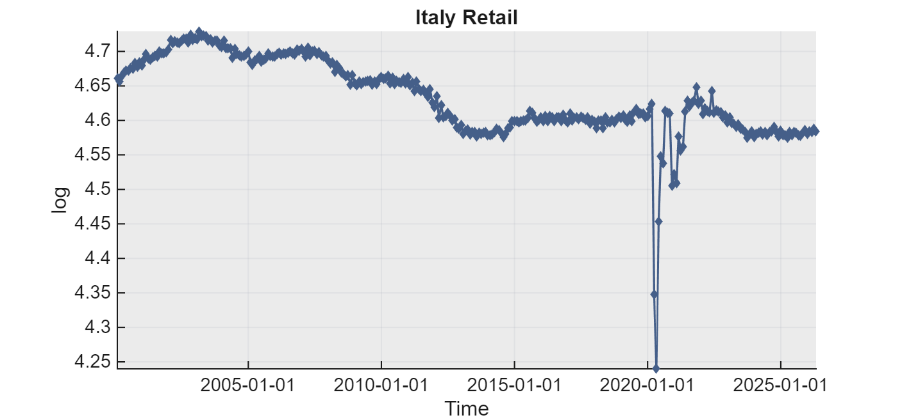

#### UNR

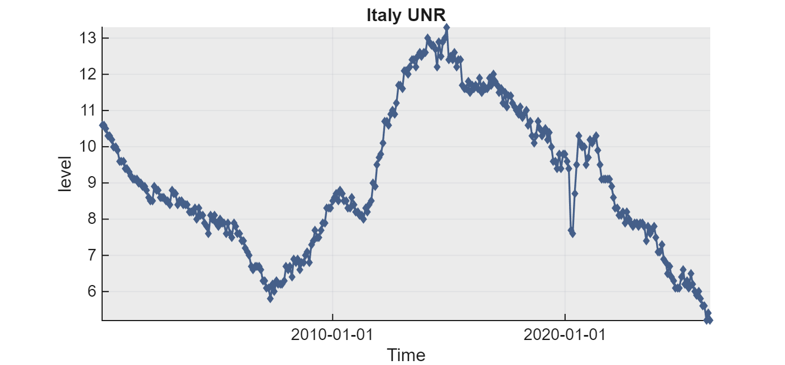

#### ConsumerConf

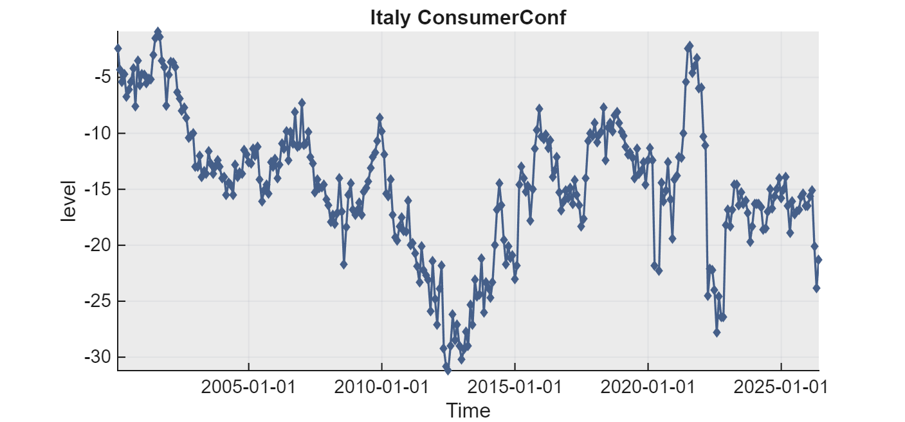

#### IndustrialConf

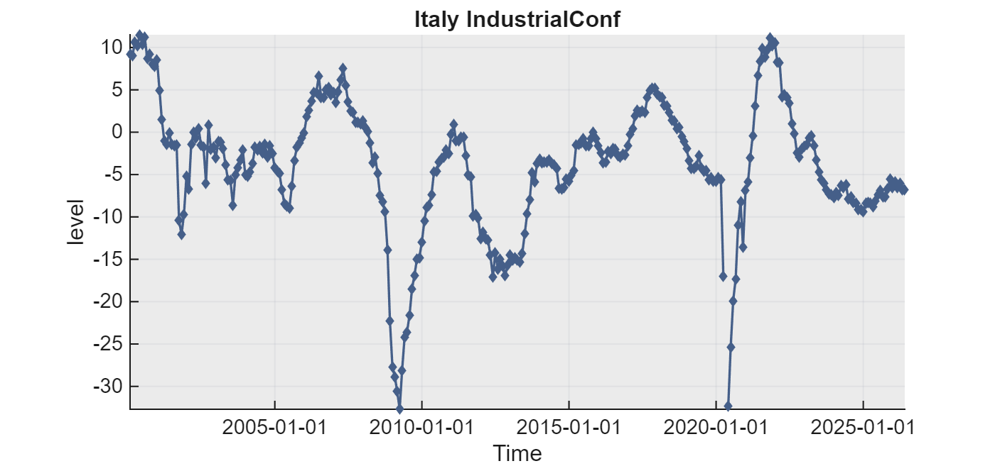

#### IPI

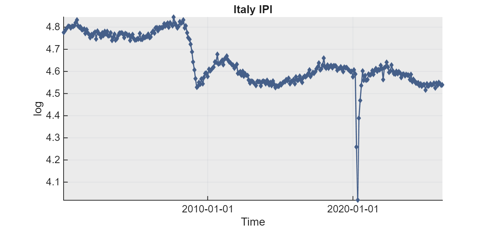

#### IPI-DE

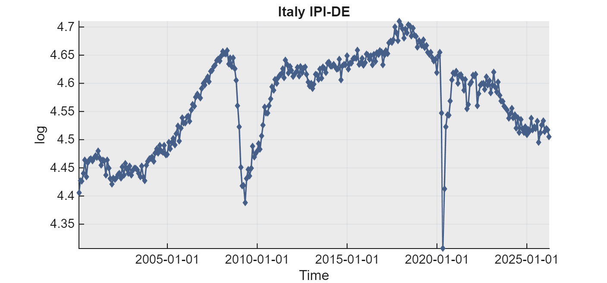

#### HICP

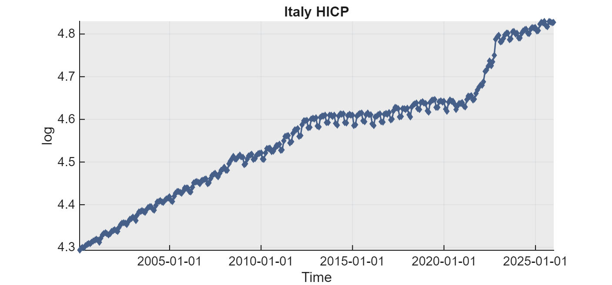

#### EURIBOR-1Y

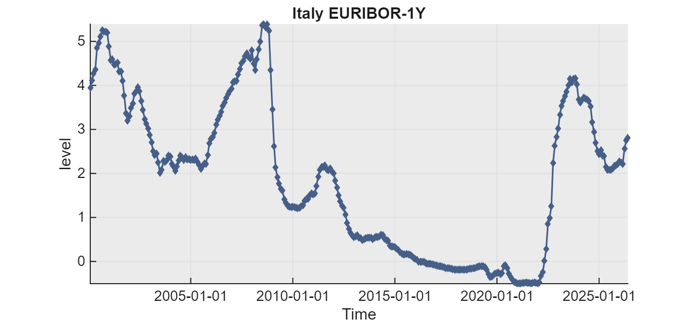

#### EXP

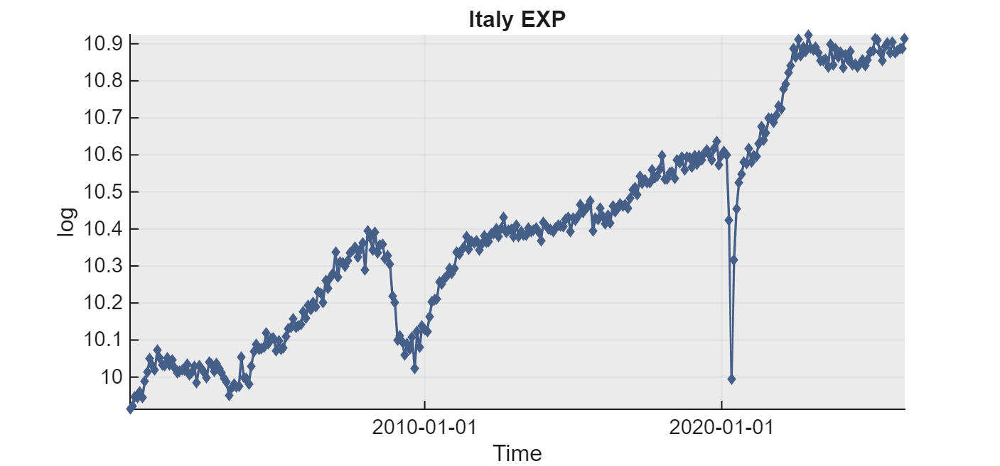

#### IMP

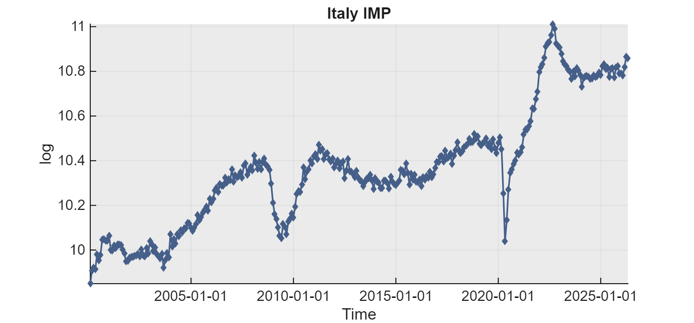

#### RGDP

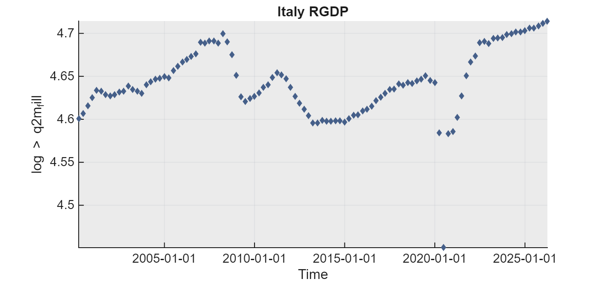

---

Report automatically generated on 30-Apr-2026 16:22:36.
