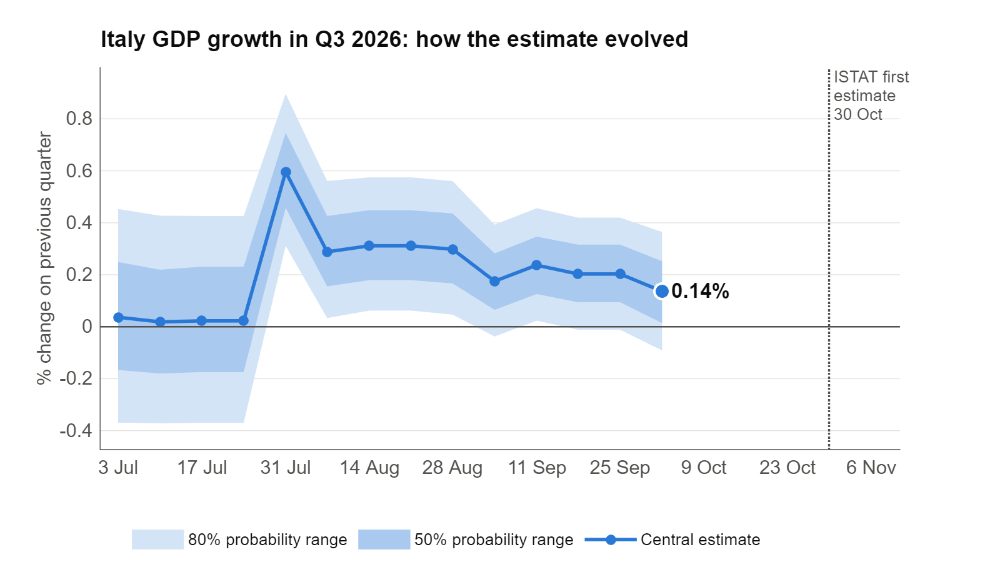
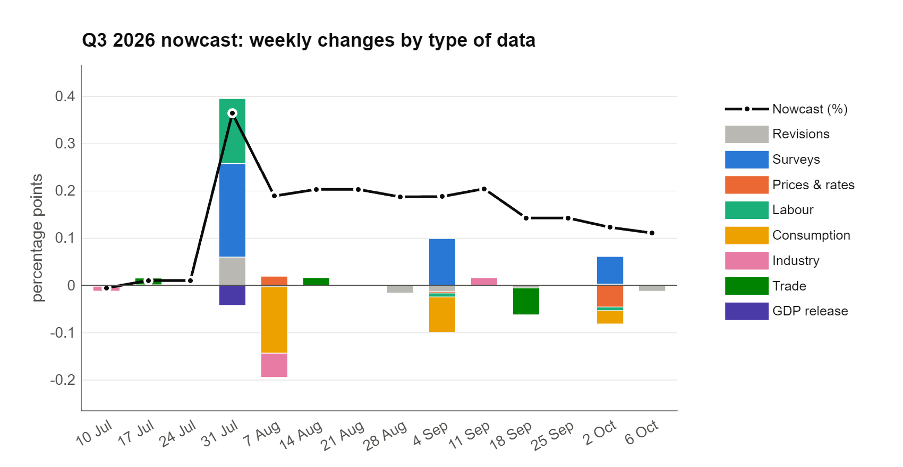
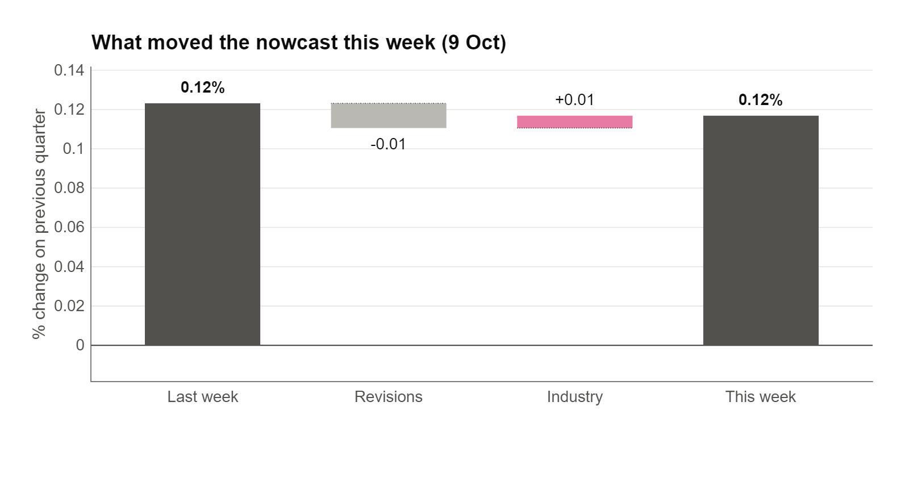
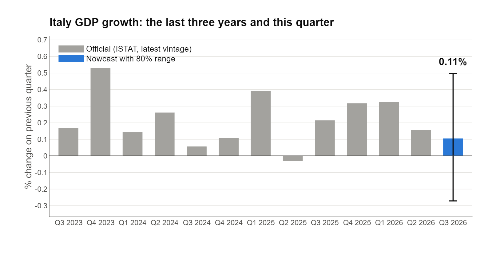
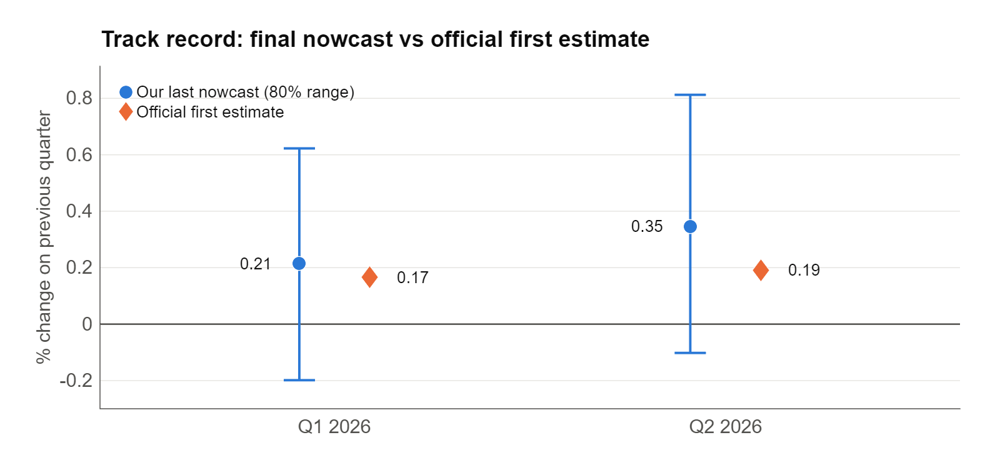
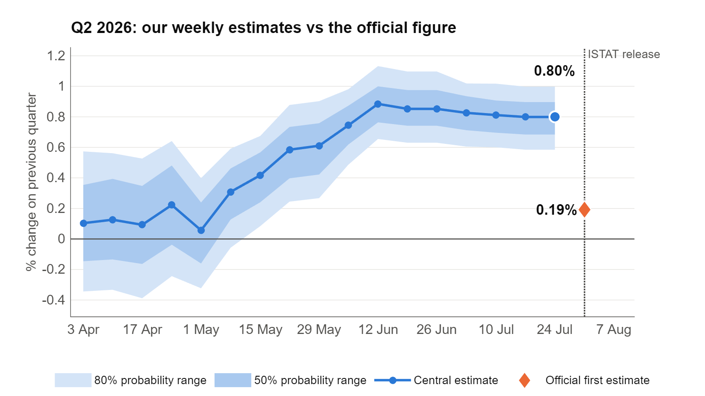
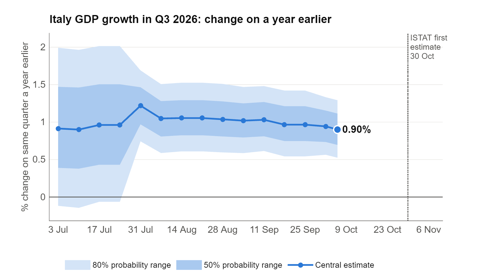

**Latest estimate, 9 October 2026:** Italy's real GDP in **Q3 2026** grew by **0.11%** compared with the previous quarter.
Likely range (80% probability): -0.26% to 0.51%. Compared with a year earlier: 0.91%.
The estimate is unchanged from last week.
{: .notice--primary style="font-size: 1.1em !important; line-height: 1.6;"}

*Updated every Friday. Next official figure: ISTAT preliminary estimate for Q3 2026, due 30 October 2026.*


{{ itnow_block | markdownify }}

## How the estimate for Q3 2026 has evolved

Each point is the estimate made on that Friday with the data available at the time. The shaded bands show the uncertainty: the darker band contains the outcome with 50% probability, the lighter band with 80%. The bands narrow as more monthly data for the quarter are published.

Each bar shows how much the data published that week moved the nowcast, split by type of data. Grey bars are revisions to figures published earlier.

## What changed this week

The data published this week moved the estimate by -0.01 percentage points (revisions -0.01, industry +0.01).

*Contributions are computed with the model: each group of releases is added in turn and the change in the average nowcast is recorded. Totals can differ from the headline figure, a median, by a few hundredths.*

New data published since last week:

- Industrial production (Aug 2026): -1.3% on previous month
- Industrial production in Germany (Aug 2026): +0.4% on previous month

## In context

Historical Italy GDP growth

Grey bars are official ISTAT figures (latest available vintage); the blue bar is this week's nowcast with its 80% range.

## How accurate has the nowcast been?

Nowcast accuracy

Every quarter we compare our last estimate before the official release with ISTAT's first estimate. Nowcasts are estimates made with incomplete real-time information.

| Quarter | Our last nowcast | 80% range | ISTAT first estimate | Difference |
|---|---:|---:|---:|---:|
| Q2 2026 | 0.35% | -0.10% to 0.81% | 0.19% | +0.15 pp |
| Q1 2026 | 0.21% | -0.20% to 0.62% | 0.17% | +0.05 pp |
| Q4 2025 | -0.06% | -0.23% to 0.11% | 0.32% | -0.38 pp |

## About the model

Mixed-Frequency Bayesian VAR (MF-BVAR)


{{ itnow_block | markdownify }}

## Details

Weekly estimates for this quarter

| Estimate made on | Quarter-on-quarter | 80% range | Year-on-year |
|---|---:|---:|---:|
| 9 October 2026 | 0.11% | -0.26% to 0.51% | 0.91% |
| 2 October 2026 | 0.12% | -0.26% to 0.51% | 0.94% |
| 25 September 2026 | 0.14% | -0.28% to 0.60% | 0.97% |
| 18 September 2026 | 0.14% | -0.28% to 0.60% | 0.97% |
| 11 September 2026 | 0.21% | -0.21% to 0.66% | 1.03% |
| 4 September 2026 | 0.19% | -0.24% to 0.64% | 1.02% |
| 28 August 2026 | 0.19% | -0.25% to 0.67% | 1.04% |
| 21 August 2026 | 0.21% | -0.23% to 0.68% | 1.05% |
| 14 August 2026 | 0.21% | -0.23% to 0.68% | 1.05% |
| 7 August 2026 | 0.20% | -0.26% to 0.66% | 1.05% |
| 31 July 2026 | 0.38% | -0.10% to 0.85% | 1.22% |
| 24 July 2026 | 0.02% | -0.62% to 0.68% | 0.96% |
| 17 July 2026 | 0.02% | -0.62% to 0.68% | 0.96% |
| 10 July 2026 | 0.00% | -0.64% to 0.66% | 0.90% |
| 3 July 2026 | 0.02% | -0.63% to 0.68% | 0.91% |

Data releases since the start of the quarter

| Week of | Indicator | Data for | Change on previous period |
|---|---|---|---:|
| 9 October 2026 | Industrial production | Aug 2026 | -1.3% on previous month |
| 9 October 2026 | Industrial production in Germany | Aug 2026 | +0.4% on previous month |
| 2 October 2026 | Industrial confidence | Sep 2026 | +1.2 points |
| 2 October 2026 | Consumer prices (HICP) | Sep 2026 | +2.0% on previous month |
| 2 October 2026 | 1-year Euribor interest rate | Sep 2026 | +0.29 percentage points |
| 2 October 2026 | Retail sales (volume) | Aug 2026 | +0.1% on previous month |
| 2 October 2026 | Unemployment rate | Aug 2026 | +0.20 percentage points |
| 2 October 2026 | Consumer prices (HICP) | Aug 2026 | +0.1% on previous month |
| 2 October 2026 | Consumer prices (HICP) | Jul 2026 | -1.0% on previous month |
| 2 October 2026 | Consumer prices (HICP) | Jun 2026 | +0.0% on previous month |
| 18 September 2026 | Exports | Jul 2026 | +0.3% on previous month |
| 18 September 2026 | Imports | Jul 2026 | -1.2% on previous month |
| 11 September 2026 | Industrial production | Jul 2026 | +0.6% on previous month |
| 11 September 2026 | Industrial production in Germany | Jul 2026 | -1.8% on previous month |
| 4 September 2026 | Consumer confidence | Aug 2026 | -0.1 points |
| 4 September 2026 | Industrial confidence | Aug 2026 | +0.8 points |
| 4 September 2026 | 1-year Euribor interest rate | Aug 2026 | +0.10 percentage points |
| 4 September 2026 | Retail sales (volume) | Jul 2026 | -0.4% on previous month |
| 4 September 2026 | Unemployment rate | Jul 2026 | +0.00 percentage points |
| 14 August 2026 | Industrial production in Germany | Jun 2026 | +0.3% on previous month |
| 14 August 2026 | Exports | Jun 2026 | +1.6% on previous month |
| 14 August 2026 | Imports | Jun 2026 | +1.0% on previous month |
| 7 August 2026 | 1-year Euribor interest rate | Jul 2026 | +0.06 percentage points |
| 7 August 2026 | Retail sales (volume) | Jun 2026 | +0.2% on previous month |
| 7 August 2026 | Industrial production | Jun 2026 | -1.0% on previous month |
| 31 July 2026 | Consumer confidence | Jul 2026 | +1.9 points |
| 31 July 2026 | Industrial confidence | Jul 2026 | +0.8 points |
| 31 July 2026 | Unemployment rate | Jun 2026 | +0.40 percentage points |
| 31 July 2026 | Real GDP | Q2 2026 | published |

Revisions to previously published data

| Week of | Indicator | Data for | Old value | New value |
|---|---|---|---:|---:|
| 9 October 2026 | Industrial production | Jul 2026 | 4.55 | 4.54 |
| 9 October 2026 | Industrial production in Germany | Jul 2026 | 4.51 | 4.50 |
| 9 October 2026 | Industrial production | Jun 2026 | 4.54 | 4.54 |
| 9 October 2026 | Real GDP | Q2 2026 | 4.72 | 4.73 |
| 2 October 2026 | Industrial confidence | Aug 2026 | -4.80 | -4.40 |
| 2 October 2026 | Retail sales (volume) | Jul 2026 | 4.58 | 4.58 |
| 2 October 2026 | Unemployment rate | Jul 2026 | 5.80 | 6.00 |
| 2 October 2026 | Industrial confidence | Jul 2026 | -5.40 | -5.20 |
| 2 October 2026 | Unemployment rate | Jun 2026 | 5.80 | 6.00 |
| 18 September 2026 | Imports | Jun 2026 | 10.89 | 10.88 |
| 11 September 2026 | Industrial production in Germany | Jun 2026 | 4.52 | 4.52 |
| 4 September 2026 | Retail sales (volume) | Jun 2026 | 4.59 | 4.58 |
| 4 September 2026 | Unemployment rate | Jun 2026 | 5.70 | 5.80 |
| 4 September 2026 | Real GDP | Q2 2026 | 4.72 | 4.72 |
| 28 August 2026 | Industrial confidence | Jun 2026 | -6.10 | -6.00 |
| 31 July 2026 | Consumer confidence | Jun 2026 | -22.20 | -22.10 |
| 31 July 2026 | Industrial confidence | Jun 2026 | -6.40 | -6.10 |

Indicators used

| Indicator | Frequency | Source | Enters the model as |
|---|---|---|---|
| Retail sales (volume) | Monthly | EUROSTAT | log level |
| Unemployment rate | Monthly | EUROSTAT | level |
| Consumer confidence | Monthly | EUROSTAT | level |
| Industrial confidence | Monthly | EUROSTAT | level |
| Industrial production | Monthly | EUROSTAT | log level |
| Industrial production in Germany | Monthly | EUROSTAT | log level |
| Consumer prices (HICP) | Monthly | EUROSTAT | log level |
| 1-year Euribor interest rate | Monthly | ECB | level |
| Exports | Monthly | ISTAT | log level |
| Imports | Monthly | ISTAT | log level |
| Real GDP | Quarterly | EUROSTAT | log level |

---

*IT Now is an independent research project by [Filippo Ferroni](/) (University of Bologna). It is not an official statistic and does not represent the views of any institution. It is not investment advice.*

<small>Page generated automatically on 09 Oct 2026 12:01.</small>
